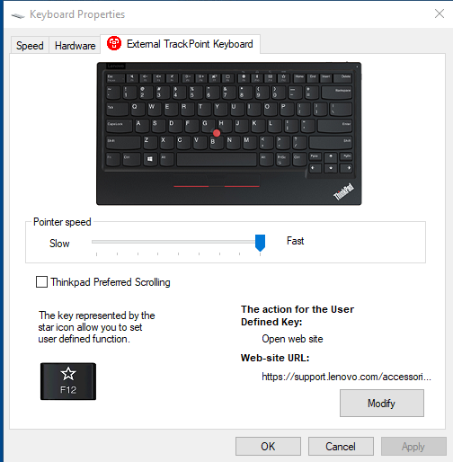
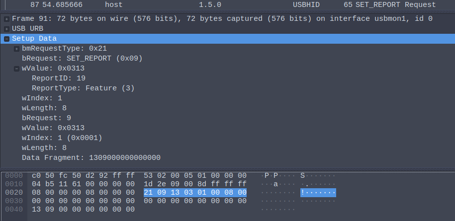

# tp2ctl
Simple python tool to allow configuration of the *Lenovo Trackpoint Keyboard II / Lenovo Trackpoint Keyboard 2* on Linux. This tool specifically allows to set the *pointer-speed* (i.e. *Trackpoint sensitivity*) and to disable/enable *Thinkpad preferred scrolling*-mode. Loosely based on [tpkbdctl](https://github.com/bseibold/tpkbdctl), this tool also uses the `hidraw` interface to connect to the keyboard.

*Tested on Ubuntu 20.04 and Arch*

## NOTE: You probably don't need this tool if you want to use your Lenovo Trackpoint Keyboard II on Linux since the keyboard is fully supported starting with kernel 5.19 (thx to @ValdikSS and @flokli). For further information see [issue #3 ](https://github.com/telecastr/tp2ctl/issues/3). Eventhough this repo is not actively maintained anymore, feel free to create a PR if you notice any issues. 

## Installation
**Install via pip:**

`pip install tp2ctl`

**Alternatively**, if you don't want to use `pip`, you can just clone the repo and run the script `tp2ctl.py` in  `src/tp2crl/` directly (no external dependencies need to be installed....)


*Note: `Python >= 3` is required to run this tool*

## Usage
*Note that access to `/dev/hidraw*` is required, you might have to run this tool as root...*

**Set the trackpoint-sensitivity to maximum:** 

 `sudo tp2ctl -s 8` 


By default, *tp2ctl* will **auto-detect** and use the first *Lenovo Trackpoint II* Keyboard on the usb-bus. If you want to manually specify a *hid-raw* device, you can do so by using the `-d` switch...
Please also note, that the settings are not permanent and have to be re-applied after the keyboard was disconnected.


```shell
usage: tp2ctl.py [-h] [-s [0-8]] [-d DEVICE] [--no-preferred-scrolling | --preferred-scrolling]

Control IBM Trackpoint 2 Keyboard features

optional arguments:
  -h, --help            show this help message and exit
  -s [0-8], --pointer-speed [0-8]
                        set trackpoint sensitivity ('Pointer Speed')
  -d DEVICE, --device DEVICE
                        set hidraw device manually
  --no-preferred-scrolling
                        enable 'Thinkpad Preferred Scrolling'
  --preferred-scrolling
                        disable 'Thinkpad Preferred Scrolling'
```

### Automatically configure when plugging in
To automatically apply settings whenever you plug in, you can use an udev rule.

Create a file at `/etc/udev/rules.d/99-tp2ctl.rules`:

```
# The Lenovo TrackPoint Keyboard II needs to be configured via raw hid commands
# Read in bInterfaceNumber into a ID_USB_INTERFACE_NUM
SUBSYSTEMS=="usb", ENV{ID_USB_INTERFACE_NUM}="$attr{bInterfaceNumber}"

# … so we can use it down here
SUBSYSTEM=="hidraw", ACTION=="add", ATTRS{idVendor}=="17ef", ATTRS{idProduct}=="60ee", ENV{ID_USB_INTERFACE_NUM}=="01", RUN+="/usr/bin/tp2ctl -s 8 --preferred-scrolling -d /dev/%k"
```

Tweak the path to the tp2ctl script, and the arguments accordingly, and make sure the script is owned and only writable by `root`.


## Known Lmitiations
* Only tested / working with 2.4GHz Transceiver
* The internal Trackpoint of my Thinkpad seems to be much more sensitive as the one of the *Trackpoint Keyboard II*. However, this behaviour can also be observed using *Windows*, so I blame *Lenovo* for this ...
* When disabling *Thinkpad preferred scrolling* the mouse middle-button is not working any more
* Horizontal scrolling does not work
* Middle-Button pastes clipboard on scolling (very annoying) 

## Windows Companion App
The Windows Companion App has two main features:
* Set the *Pointer Speed*
* Enable/Disable *Thinkpad Preferred Scrolling* 
  (*Thinkpad Preferred Scrolling* enables vertical scrolling in Windows)



## Protocol
The Windows Companion App sends USB `SET_REPORT`requests to configure the keyboard. Specifically a `SET_REPORT (Feature)`with Feature-ID `0x13`and a payload of 8 + 1 bytes (first byte beeing the Feature-ID) is transmitted. The Windows App seems to send every setting-related package twice. The screenshot shows the tramssion of the *Disable Preferred Scrolling* packet. You can find the `.pcap` files with the USB-Traces in the folder `pcaps`

*Note: Further information on`SET_REPORT (Output)`and `SET_REPORT (Feature)` requests can be found at the [USB HID Definition](https://www.usb.org/sites/default/files/documents/hid1_11.pdf) (Pages 29 & 52)*



### Payloads
#### Pointer Speed
| Speed   | Data Fragment |
|---|-----|
|  1 | `0x13 0x02 0x01 0x00 0x00 0x00 0x00 0x00 0x00`|
|  2 | `0x13 0x02 0x02 0x00 0x00 0x00 0x00 0x00 0x00`|
|  3 | `0x13 0x02 0x03 0x00 0x00 0x00 0x00 0x00 0x00`|
|  4 | `0x13 0x02 0x04 0x00 0x00 0x00 0x00 0x00 0x00`|
|  5 | `0x13 0x02 0x05 0x00 0x00 0x00 0x00 0x00 0x00`|
|  6 | `0x13 0x02 0x06 0x00 0x00 0x00 0x00 0x00 0x00`|
|  7 | `0x13 0x02 0x07 0x00 0x00 0x00 0x00 0x00 0x00`|
|  8 | `0x13 0x02 0x08 0x00 0x00 0x00 0x00 0x00 0x00`|
|  9 | `0x13 0x02 0x09 0x00 0x00 0x00 0x00 0x00 0x00`|

#### Preferred Scrolling

|    | Data Fragment |
|---|-----|
|  Enable | `0x13 0x09 0x00 0x00 0x00 0x00 0x00 0x00 0x00`|
|  Disable | `0x13 0x09 0x01 0x00 0x00 0x00 0x00 0x00 0x00`|

#### Unknown

|    | Data Fragment |
|---|-----|
|  Reset to defaults (?) | `0x13 0x05 0x00 0x00 0x00 0x00 0x00 0x00 0x00`|
|  Initialize (?) | `0x13 0x01 0x0a 0x00 0x00 0x00 0x00 0x00 0x00`|

## ToDo
* Implement/Test bluetooth-support
* Fix pasting on middle-button click
